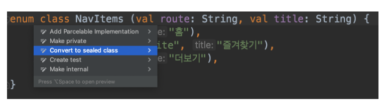
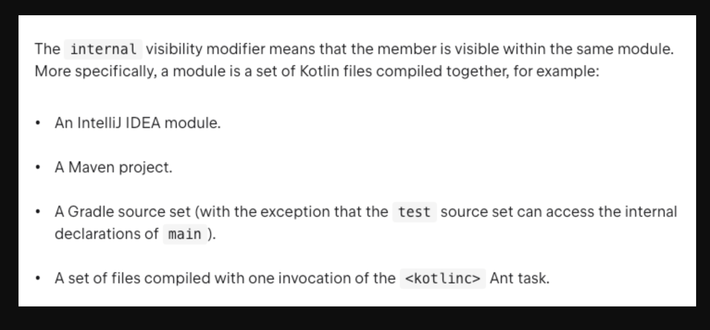
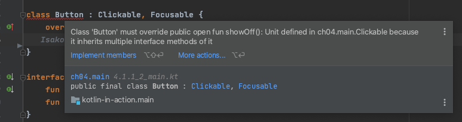

# 2주차

# 개요

- 클래스, 상속, 인터페이스
- Aggregation, Composition
- Dependency Injection

# 클래스

자바의 클래스와 다른 점

- default `final`
- 내부에 선언한 클래스 → defualt `static nested class`
    - 중첩 클래스에는 외부 클래스에 대한 참조가 없음
        
        ```kotlin
        class A {
        		val aNum = 10
            
        		class B {
        				fun getAnum() = println(aNum)  // impossible!
            }
        }
         
        fun main() {
            val b = A.B()
        }
        ```
        
    - 외부 클래스를 참조할 수 있는 종속적인 내부 클래스 → `inner class`
        
        ```kotlin
        class A {
        		val aNum = 10
        		val num = 20
        
            inner class B {
        				val num = 30
        				
        				fun getAnum() = println(aNum)  // possible!
        				fun getNum() = println(this@A.num)  // this@클래스이름
            }
        }
         
        fun main() {
            val b = A().B()
        }
        ```
        
- 데이터 보관 목적의 클래스 → `data class`
    - `toString()`, `hashCode()`, `equals()`, `copy()` 기본 구현

## sealed class

자신을 상속받는 서브 클래스의 종류를 제한하는 클래스

```kotlin
sealed class Shape {
	class Circle(val rad: Double): Shape()
	class Rectangle(val width: Double, val height: Double): Shape()
}
class Triangle(val base: Double, val height: Double): Shape()
```

- **자신이 추상 클래스**이고, **자신을 상속받는 복수의 서브 클래스**를 가질 수 있음
- **자신을 상속받는 서브 클래스의 종류 제한** 가능
    - `sealed class`를 상속하는 클래스들은 같은 파일 내에 선언되어야 함
        - `sealed class`를 상속하는 클래스를 상속하는 클래스는 다른 파일에도 가능
    - `private` 생성자만 가짐

```kotlin
sealed class Expr {
    class Num(val value: Int) : Expr()
    class Sum(val left: Expr, val right: Expr) : Expr()
}

fun eval(e: Expr): Int =
    when (e) {
        is Expr.Num -> e.value
        is Expr.Sum -> eval(e.right) + eval(e.left)
				// else 불필요
    }
```

### enum class와 sealed class 비교

둘 다 타입을 제한시키기 위해 많이 사용한다.

|  | enum | sealed |
| --- | --- | --- |
| 생성자 | 형태가 동일해야 함 | 각기 달라도 가능 |
| state | single instance로써 하나의 객체만 제한적으로 사용 가능 | state를 포함하는 여러 객체 사용 가능 |
| 유용한 상황 | - 고정된 값의 집합을 나태내야 하고 각 값에 고유 ID가 있는 경우  - when에서 사례로 사용할 수 있는 단순하고 닫힌 값의 집합을 나타낼 때 | - 각 값이 서로 다른 형식의 개체인 보다 복잡한 값 집합을 나타내야 할 때  - 기존 코드를 변경하지 않고, 추후 새로운 값을 추가할 수 있는 열린 값 집합을 나타내야 할 때 |

```kotlin
sealed class OsSealed {
    object Linux : OsSealed()
    object Windows : OsSealed()
    object Mac : OsSealed()
}

...
when (osSealed) {
    is OsSealed.Linux -> println("${osSealed.company} - Linux Operating System")
    is OsSealed.Mac -> println("${osSealed.company} - Mac Operating System")
    is OsSealed.Windows -> println("${osSealed.company} - Windows Operating System")
}
...
```

```kotlin
enum class OsEnum {
    Linux,
    Windows,
    Mac
}

...
when (osEnum) {
    is OsEnum.Linux -> println("${osEnum.company} - Linux Operating System")
    is OsEnum.Mac -> println("${osEnum.company} - Mac Operating System")
    is OsEnum.Windows -> println("${osEnum.company} - Windows Operating System")
}
...
```

`sealed class`는 `enum`과 `abstract class`가 혼합되어 있는 형태로 볼 수 있다. 따라서 필요에 따라 여러 사용자 정의 생성자를 추가할 수 있고, 서로 다른 이름, 매개변수 및 반환 유형을 사용해 여러 함수를 정의할 수 있다. 

반면 `enum class`는 각 열거형 상수에 서로 다른 함수를 정의할 수 없다. 그래서 불필요한 메소드 및 초기화 값을 전달해야 할 수도 있다.

```kotlin
enum class OsEnum(val releaseYear: Int = 0, val company: String = "") {
    Linux(0, "Open-Source") {
        override fun getText(value: Int): String {
            return "Linux by $company - value=$value"
        }
    },
    Windows(0, "Microsoft") {
        override fun getText(value: Int): String {
            return "Windows by $company - value=$value"
        }
    },
    Mac(2001, "Apple") {
        override fun getText(value: Int): String {
            return "Mac by $company - released at $releaseYear"
        }
    },
    Unknown {
        override fun getText(value: Int): String {
            return ""
        }
    };

    abstract fun getText(value: Int): String

    fun getTextParent(): String {
        return "Called from parent enum class"
    }
}
```

그렇다면 모든 상황에서 `enum` 대신 `sealed class`를 사용하는 것이 더 장점을 가질까?

열거된 상수에 대해 기능이 거의 또는 전혀 없는 경우 `enum`을 사용하는 것이 더 좋다. ↔ 서로 다른 데이터를 보유하고 서로 다른 논리를 구현하는 상수 열거의 경우 `sealed`

enum이 sealed 대비 가지는 장점

- 생성자의 형태를 모두 동일하게 가져가야 하는 경우도 상당히 많음
- iterate 가능
    
    ```kotlin
    Colors.values().map { "$it 색상 옵션" }.forEach { println(it) }
    
    enumValues<Colors>().map { "enumValueOf 사용: $it" }.forEach { println(it) }
    ```
    
- `enumValueOf()`, `valueOf()`로 enum 값을 가져올 수 있음
    
    ```kotlin
    val selected = enumValueOf<Colors>("BLUE").text
    val selected = Colors.valueOf("BLUE").text
    ```
    
- intelliJ 메뉴로 `enum`에서 `sealed`로 손쉽게 변환 가능
    
    
    

# 상속

상속이란 상위 클래스 멤버(함수, 프로퍼티)를 하위 클래스에서 자신의 멤버처럼 사용할 수 있게 하는 기능이다.

```kotlin
open class Base(p: Int) {
    fun testFunction() {}
}

class Derived(p: Int) : Base(p)
```

자바에서 최상위 클래스가 Object인 것처럼 코틀린에서는 최상위 클래스가 Any이다. 즉, 모든 코틀린 클래스는 [Any 클래스](https://kotlinlang.org/api/latest/jvm/stdlib/kotlin/-any/)의 상속을 받는다. 

```kotlin
class Example // Implicitly inherits from Any
```

거의 대부분이 자바와 동일한 상속 개념을 갖고 있지만 큰 차이점이 하나 있다. 코틀린은 자바와 달리 모든 클래스 및 멤버가 기본적으로 `final` 선언이 되어 있는데 이는 상속을 불가능하게 한다. 만약 상속이 가능하게 만드려면 별도로 `open` 키워드를 사용해야 한다. 

```kotlin
open class Shape {
		open val vertexCount: Int = 0
    
		open fun draw() { /*...*/ }
    fun fill() { /*...*/ }
}

class Circle() : Shape() {
		override val vertexCount = 4

    final override fun draw() { /*...*/ }
}
```

위의 코드를 예시로 보면 `shape` 클래스와 `draw` 함수는 `open`키워드를 명시했기 때문에 상속 및 오버라이드가 가능하지만 `fill`함수와 같이 `open` 키워드가 없을 경우 override가 불가능하다. 또한 `Circle.draw`처럼 override한 함수에 `final` 선언을 하면, `Circle`을 상속하는 다른 클래스에서 이 함수를 override하지 못하도록 막을 수 있다. 

`val`로 선언한 프로퍼티도 getter/setter 함수를 오버라이드할 수 있으므로 재정의가 가능하다. 여기서 주의할 점은 `val` 프로퍼티를 `var`로 재정의는 가능하지만, `var` 프로퍼티를 `val` 프로퍼티로 재정의 하는 것은 불가능하다. 기존에 존재하던 getter를 재정의하고 setter를 추가 선언하기 때문이다. 반대의 경우, setter를 제거해야 하는데 이는 상속으로 불가능하다.

## 코틀린은 왜 default로 final을 채택하였나

첫번째 이유로 코틀린은 **가변을 사용했을 때 발생하는 문제를 최대한 방지**하기 위해 최대한 불변을 기본으로 하고 있다.

두번째 이유는 **상속**에 있는데 더 자세히 알아보자.

자바에서도 상속, 오버라이딩과 관련해 다음 권장사항이 존재했다.

- 오버라이딩 가능한 메소드는 반드시 문서화하고, 상황에 따라 다르게 구현될 수 있음을 자세히 명시해야 한다. (오버라이드로 인해 본래의 의도와는 다른 동작을 하도록 바뀔 수 있는 위험이 존재하기 때문)
- 오버라이딩 가능한 메소드는 하위 클래스를 만들어 반드시 테스트한다.
- 생성자에서 오버라이딩 가능 메소드를 호출하면 원하지 않는 동작을 할 수 있다.
- 위와 같은 이유로 `clone`과 `readObject`에서 오버라이딩 가능 메소드를 호출하면 원치 않는 동작을 할 수 있다.

상속을 사용시 개발자들의 실수로 인해 위와 같은 부작용을 일으킬 가능성이 있다. 따라서 기본으로 `final`을 선언하여 예측 가능성을 높여 안정성을 증가시켰다.

세번째 이유는 **컴파일 시점의 차이**가 존재한다는 것이다. 코틀린의 `final` 클래스 및 멤버 함수는 컴파일 시점에 정적 바인딩을 이용하기 때문에 런타임에 다형성 체크를 하지 않는다. (`open`키워드를 사용하면 동적 바인딩이 이뤄져 런타임에 다형성 체크)

이는 가상호출의 오버헤드를 줄이고, 최적화를 가능하게 하여 성능 향상에 도움을 준다. 

## Internal 가시성 변경자

가시성 측면에서 코틀린이 자바와 다른 점이 있다.

첫번째로 변경자를 선언하지 않는 경우 default로 `public`이다. 

두번째, 코틀린은 패키지를 namespace를 관리하기 위한 용도로만 사용하기 때문에 **패키지를 가시성 제어에 사용하지 않는다**. 코틀린에서는 이것의 대안으로 `internal`이라는 새로운 가시성 변경자를 도입했다.

`internal`은 동일한 모듈 내부에서만 접근이 가능하도록 하는 변경자이다. (**module-private**) 

코틀린은 모듈이라는 단위를 아래와 같이 정의한다.


```kotlin
internal open class TalkativeButton : Focusable {
		private fun yell() = println("Hey!")
		protected fun whisper() = println("Let's talk!")
}

fun TalkativeButton.giveSpeesh() {
		yell()
		whisper() // 오류: "whisper"에 접근할 수 없음: "whisper"는 "TalkativeButton"의 "protected" 멤버임
}
```

### 코틀린 접근 제어자

| 변경자  | 클래스 멤버 | 최상위 선언 |
| --- | --- | --- |
| public | 모든 곳에서 참조 가능 | 모든 곳에서 참조 가능 |
| internal | 동일 모듈 내부에서만 참조 가능 | 동일 모듈 내부에서만 참조 가능 |
| protected | 하위 클래스 내부에서만 참조 가능 | X (최상위 선언에 적용 불가) |
| private | 같은 클래스 내부에서만 참조 가능 | 같은 파일 내부에서만 참조 가능 |

자바의 `protected`는 같은 패키지 내부라면 그 멤버에 접근이 가능하지만, 코틀린에서는 하위 클래스에서만 참조 가능하다는 점에서 자바와 코틀린의 `protected`가 다른 것을 알 수 있다.

> 자바에는 `internal` 키워드가 없기 때문에 코틀린 컴파일러는 컴파일 시 `internal class`의 이름과 메소드 명을 알아볼 수 없게 변경한다.
> 

# 인터페이스

상속과 마찬가지로 콜론(`:`)으로 구현한다.

```kotlin
interface clickable {
		fun click()
		fun showOff() = println("I'm clickable")  // default 구현 가능
}
class Button : Clickable {
		override fun click() = println("I was clicked")
}
```

다중 인터페이스 상속을 할 때 동일한 메소드가 구현되어 있다면 하위 클래스에서 반드시 구현되어야 한다.

```kotlin
interface Focusable {
		fun showOff() = println("focus!")
}

class Button : Clickable, Focusable {
		override fun click() = println("I was clicked")
		override fun showOff() = println("this is essential")  // 필수
}
```




# Aggregation

# Composition

# Dependency Injection